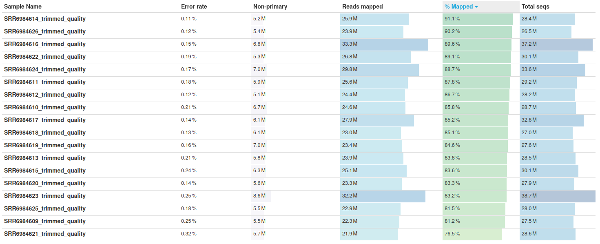

# Abstract

The white adipose tissue, also known as fat tissue or fatty tissue, is a connective tissue mainly composed of fat cells called adipocytes whose main function is to store excess energy in the form of fatty molecules, mainly triglycerides.

In this analysis three types of white adipose tissues were subjected to a differential expression analysis to see the effects high fat diets have on Mus Musculus, the results show that: 

- Signitficantly differentially expressed genes are associated with: abnormal bone structure, decreased prepulse inhibition, increased bone mineral content, increased lean body mass, thrombocytopenia, decreased red blood cell distribution width and increased grip strength.

- High fat diets: influence the internal clock, the way the organism manages energy, decrease deffenses by affecting leukocytes, and increase the chance of developing tumors.

- Finally, in all three tissues most biological processes affected by high fat diet are: cellular, metabolic, multicellular organismal, developmental or immune system. There are also some that are: reproductive process, growth, or viral process.

# Purpose

The white adipose tissue, also known as fat tissue or fatty tissue, is a connective tissue mainly composed of fat cells called adipocytes whose main function is to store excess energy in the form of fatty molecules, mainly triglycerides.

A part from storing energy, this tissue is also in charge of performing important endocrine and metabolic roles by secreting several biologically active factors known as adipokines, which contribute to a variety of different functions, including regulation of energy balance, food intake and satiety, inflammatory response, and metabolism of steroid hormones. Furthermore, fatty tissue also helps cushion and protect parts of the body, as well as insulate the body from extreme temperatures. 

In this analysis the public samples from "RNA sequencing of white adipose tissue of lean and obese mice"[@GSE112999] will be used to see how a 45% high fat diet affects mus musculus epididymal white adipose tissue (EWAT), inguinal white adipose tissue (IWAT), retroperitoneal white adipose tissue (RWAT).

# Objectives

The main objectives of this analysis are:

- Count features of each sample.

- Identify differentially expressed genes.

- Associate these genes to GO biological processes.

# Methods

The following steps were performed in this analysis:

- **Download data and evaluate its quality:** The data was downloaded from SRA Run Selector
using SRA Toolkit[@Han2019] and its quality evaluated with both fastqc[@Andrews2010] and multiqc[@Ewels2016] (DownloadAndProcessFiles.sh and multiqc.sh).

- **Trimming:** Those reads that appear to have bad quality were removed using trimmomatic[@Bolger2014], after this process a new quality analysis was performed to check if the quality of the samples had improved (Trimming.sh).

- **Alignment:** Reads from the three samples were aligned separately to Mus Musculus reference genome GRCm38 using hisat2[@Kim2019] and the corresponding indexed genome in the tools website, the results were transforme to BAM format using samtools[@Danecek2021] (Alignment.sh).

- **Sort, index and evaluate quality of alignment:** The alignments performed were sorted and index with samtools, additionally, samtools stat and multiQC were used to evaluate the quality of each of them (ProcessAlignments.sh).

- **Removing unmapped reads:** Since alignment quality reports showed some reads were unmapped, these were removed, the remainging bams were index and ordered again and the quality reports were generated a second time to make sure no unmapped reads remained (RemoveUnmappedReads.sh).

- **Feature Counts:** The counts for each gene in each samples were computed using _featureCounts_ from _Rsubread_[@Liao2019], the gtf file necessary for this step was obtained from Ensembl[@Martin2023] database (DifferentialExpression.R).

- **Differential Gene Expression Analysis:** With DESeq2[@Love2014] counts were processed, an Exploratory Data Analysis was performed by stabilising RNA-Seq variance and creating a Heatmap with the 20 genes that had most counts using pheatmap[@Kolde2012] and a PCA. For each type of white adipose tissue a volcano plot was made and the counts of the top 10 more expressed genes were ploted (DifferentialExpression.R). Ensembl database was used to look for the phenotypes associated with the most significantly differentially expressed gene of each tissue. 

- **GO enrichment:** Finally, the biological processes of the most significantly differentially expressed genes were computed with function _enrichGO_ from library _clusterProfiler_[@Yu2012] (DifferentialExpression.R) and the most affected biological processes groups were computed with function _groupGO_ from the same package. The meaning for the four most relevant GO terms in each tissue was looked on QuickGO[@Binns2009].

The source code for this project can be found at: https://github.com/OSCAR-CASALS/Differential-Expression-Analysi-analysis-of-45-high-fat-diet-in-Mus-Musculus-white-adipose-tissue

# Results

## Quality analysis

### Raw Reads

Quality report for raw reads showed that SRR6984616 and SRR6984623 had more sequences than the others and that SRR6984618, SRR6984619 and SRR6984620 possesed less unique reads than the rest.

The samples with more sequences were both of a mus musculus that had a 45% high fat diet, SRR6984616 coming from inguinal white adipose tissue and SRR6984623 from retroperitoneal white adipose tissue.

The samples with low unique reads all come from control mouse that followed a standard diet and were extracted from inguinal white adipose tissue.


**Figure 1:** Sequence counts of raw reads.

Per Base Sequence Content shows that some bases at the start of the sequence did not have the expected ammount of Adenine, Citocine, Thymine and Guanine; these phenomenon is common in RNA-sequencing, the affected positions were removed via trimming.


**Figure 2** Per base sequence content of raw reads.

Samples SRR6984609, SRR6984617, SRR6984619, SRR6984620 had SRR6984621 irregular GC content, from these samples all except SRR6984619 and SRR6984620 come from mouse that followed the 45% high fat diet therefore could be explained by the presence of upregulated genes.


Sequence Duplication Levels of all samples except SRR6984614 and SRR6984622 were too high, but this can be explained by the presence of upregulated genes that have identical reads.


**Figure 3** Sequence duplication levels of raw reads.

Finally, some adapter sequences were found in the samples but these were not in quantities that could influence the analysis results, eitherway they were removed in the trimming step as a precaution.


**Figure 4** Adapter content of raw reads.

### Trimmed Reads

After trimming the problems related with Per Base Sequence Content were removed and the quantity of adapters was reduced.


**Figure 5** Per base sequence content of trimmed reads.


**Figure 6** Adapter content of trimmed reads.

### Alignment

The quality report shows that most alignments have over 80% of mapped reads and low error rates, being SRR6984621 sample the only one with a percentage of mapped reads lower than 80% (76.5%) and the one with the highest error rate(0.32%). While the other error rates are lower than 0.26%, examining the higher ones shows that samples from mice that followed the 45% high fat diet usually have bigger error rate than those mouse that did not follow any special diet. 



**Figure 7** General statistics of alignments

Alignment scores show that SRR6984616, SRR6984617, SRR6984623 and SRR6984624 have more mapped reads than the rest, this is to be expected as the previous quality reports showed these samples were the ones that had more reads. Since upregulated and downregulated genes can decrease mapping quality without being the result of technical biases, those reads with a mapping quality of 0 were not removed.


**Figure 8** Alignment scores of algnments, color blue corresponds to reads with a mapping quality higher than 0, yellow to reads with a mapping quality of 0, and red to unmaped reads.

## Diferential Expresion analysis

To see wether was posible to distinguish samples from mice that followed a 45% high-fat diet from control ones a PCA was performed, figure 9 shows that, indeed, it is posible to separate by diet each tissue sample.

```{r, echo = FALSE, message = FALSE, warning = FALSE}
load("data/PCA.Rda")
PCA
```

**Figure 9** PCA, color Dark Purple corresponds to EWAT samples that followed a 45 High Fat Diet, color Dark Blue corresponds to IWAT samples that followed a 45 High Fat Diet, color Teal corresponds to RWAT samples that followed a 45 High Fat Diet, color Green corresponds to EWAT samples that followed a Standard Diet, color Light Green corresponds to IWAT samples that followed a Standard Diet, color Yellow corresponds to RWAT samples that followed a Standard Diet.

The following heatmap shows that gene ENSMUSG00000025153 has lower counts in samples: SRR6984609, SRR6984610, SRR6984611, SRR6984616, SRR6984617, SRR6984621, SRR6984622 and SRR6984623; all these samples belong to rats that followed a 45% high fat diet therefore this gene could be under expressed because of the eating habits of the mice.


**Figure 10** Heatmap with the gene count of the top 20 genes with more counts.

## Epididymal white adipose tissue (EWAT)

Epididymal white adipose tissue's volcano plot shows that most significantly differentially expressed genes are overexpressed in those mice that followed the standard diet, therefore a high fat diet reduces their expression.


**Figure 11:** Volcano plot of EWAT, x axis shows the $Log_2$ fold change while y axis displays $-Log_{10} P$ values.Genes with a $Log_{2}$ fold change higer than 0 are overesxpressed in mice that followed the standard diet while those with a negative $Log_2$ fold change are underxpressed. Those genes whose p value is lower than 0.05 are considered significantly differentially expressed. Labeled dots correspond to the top 10 most significantly differentially expressed genes.

The most significantly differentially expressed gene in the volcano plot corresponds to **Dennd2d** (Ensemble ID: ENSMUSG00000027901) which is associated to: 

- **Abnormal bone structure**

- **Decreased prepulse inhibition**

- **Increased bone mineral content**

- **Increased lean body mass**

- **Thrombocytopenia**

The enrichment GO analysis shows that the most affected biological process is **rythmic process** as it has a low adjusted pvalue and a high ammount of counts, Gene Ontology defines this term as: "Any process pertinent to the generation and maintenance of rhythms in the physiology of an organism", which means that high fat diets alters rythmic patterns in an organism's physiology.

Other biological process affected and their Gene Ontology definitions are:

- **Negative regulation of amine transport**: Any process that stops, prevents, or reduces the frequency, rate or extent of the directed movement of amines into, out of or within a cell, or between cells, by means of some agent such as a transporter or pore.

- **Circadian regulation of gene expression:** Any process that modulates the frequency, rate or extent of gene expression such that an expression pattern recurs with a regularity of approximately 24 hours.

- **Regulation of amino acid transport** Any process that modulates the frequency, rate or extent of the directed movement of amino acids into, out of or within a cell, or between cells, by means of some agent such as a transporter or pore. 

```{r, echo = FALSE, message = FALSE, warning = FALSE, fig.height = 10}
load("data/EWAT_GO_Barplot.Rda")
Bar_Ewat
```

**Figure 12** Barplot displaying the forty most significantly affected GO Biological Processes. X axis displays the counts of each process while y axis the name of the processes.

Observing the definitions of the four processes above reveals that all of this terms are related to determining the rythm of a process, which could mean that high fat diets disrupt the internal clock.

Figure 13 shows that most biological processes affected by high fat diet are: metabolic processes, cellular processes, multicellular organismal processes, developemental processes or immune system process. There are also some that are: reproductive process, growth, or viral process.


**Figure 13** Groups at which the significant differentially expressed genes belong to. X axis displays the counts of each group while y axis the name of the group.

## Inguinal white adipose tissue (IWAT)

Just as in epididymal white adipose tissue, most significantly differentially expressed genes are overexpressed in those mice that followed the standard diet, therefore a high fat diet reduces their expression.


**Figure 14** Volcano plot of IWAT, x axis shows the $Log_2$ fold change while y axis displays $-Log_{10} P$ values.Genes with a $Log_{2}$ fold change higer than 0 are overesxpressed in mice that followed the standard diet while those with a negative $Log_2$ fold change are underxpressed. Those genes whose p value is lower than 0.05 are considered significantly differentially expressed. Labeled dots correspond to the top 10 most significantly differentially expressed genes.

The most significantly differentially expressed gene in the volcano plot is **Pcx** (Ensemble ID: ENSMUSG00000024892), which is associated with: 

- **Decreased red blood cell distribution width**

- **Increased grip strength** 

The enrichment GO analysis shows that the biological process most affected by a high fat diet is **generation of precursor metabolites and energy** as it has a low adjusted p value and a lot of counts, this term is defined in Gene Ontology as: "The chemical reactions and pathways resulting in the formation of precursor metabolites, substances from which energy is derived, and any process involved in the liberation of energy from these substances." which implies that high fat diets disrupt the way our body gains energy.

Other biological process affected and their Gene Ontology definitions are:

- **Energy derivation by oxidation of organic compounds:** The chemical reactions and pathways by which a cell derives energy from organic compounds; results in the oxidation of the compounds from which energy is released.

- **acetyl-CoA metabolic process:** The chemical reactions and pathways involving acetyl-CoA, a derivative of coenzyme A in which the sulfhydryl group is acetylated; it is a metabolite derived from several pathways (e.g. glycolysis, fatty acid oxidation, amino-acid catabolism) and is further metabolized by the tricarboxylic acid cycle. It is a key intermediate in lipid and terpenoid biosynthesis.

- **Muscle system process:** An organ system process carried out at the level of a muscle. Muscle tissue is composed of contractile cells or fibers.

```{r, echo = FALSE, message = FALSE, warning = FALSE, fig.height = 10}
load("data/IWAT_GO_Barplot.Rda")

Bar_Iwat
```

**Figure 15** Barplot displaying the forty most significantly affected GO Biological Processes. X axis displays the counts of each process while y axis the name of the processes.

The four processes defined above are related to how Mus musculus handle energy, therefore, it is safe to assume that high fat diets disrupt the way the body manages energy.

Just as with epididymal white adipose tissue, figure 16 shows that most biological processes affected by high fat diet in Inguinal white adipose tissue are: cellular processes, metabolic processes, multicellular organismal process, developmental proces or immune system process. There are also some that are: reproductive process, growth, or viral process.


**Figure 16** Groups at which the significant differentially expressed genes belong to. X axis displays the counts of each group while y axis the name of the group.

## Retroperitoneal white adipose tissue (RWAT)

Just as with the other two tissues, most significantly differentially expressed genes are overexpressed in those mice that followed the standard diet, therefore a high fat diet reduces their expression.


**Figure 17** Volcano plot of RWAT, x axis shows the $Log_2$ fold change while y axis displays $-Log_{10} P$ values.Genes with a $Log_{2}$ fold change higer than 0 are overesxpressed in mice that followed the standard diet while those with a negative $Log_2$ fold change are underxpressed. Those genes whose p value is lower than 0.05 are considered significantly differentially expressed. Labeled dots correspond to the top 10 most significantly differentially expressed genes.

The most significantly differentially expressed gene in the volcano plot corresponds to **Dennd2d** (Ensemble ID: ENSMUSG00000027901) which is associated to:

- **Abnormal bone structure**

- **Decreased prepulse inhibition**

- **Increased bone mineral content**

- **Increased lean body mass**

- **Thrombocytopenia**

The significantly expressed process with more counts is **generation of precursor metabolites and energy**, the same as in Inguinal white adipose tissue which implies that in both this tissues high fat diets disrupt the way our body gains energy.

Other biological process affected and their Gene Ontology definitions are:

- **Myeloid leukocyte activation:** A change in the morphology or behavior of a myeloid leukocyte resulting from exposure to an activating factor such as a cellular or soluble ligand. 

- **Leukocyte migration:** The movement of a leukocyte within or between different tissues and organs of the body.

- **Regulation of tumor necrosis factor superfamily cytokine production:**  Any process that modulates the frequency, rate or extent of tumor necrosis factor superfamily cytokine production.

It has also been found that in this tissues high fat diets highly affect **phagocytosis**, the process by which a cell engulfes large particles using its plasma membrane and is a major mechanism ro remove pathogens and cell debris.

```{r, echo = FALSE, message = FALSE, warning = FALSE, fig.height = 10}
load("data/RWAT_GO_Barplot.Rda")

Bar_RWAT
```

**Figure 18** Barplot displaying the forty most significantly affected GO Biological Processes. X axis displays the counts of each process while y axis the name of the processes.

Most of the processes above are related to leukocytes or tumors, which means that high-fat diets reduce the deffenses of organisms and increase the chances of developing a tumor.

Just as with the other two tissues, figure 19 shows that most biological processes affected by high fat diet in Inguinal white adipose tissue are: cellular processes, metabolic processes, multicellular organismal process, developmental proces or immune system process. There are also some that are: reproductive process, growth, or viral process.


**Figure 19:** Groups at which the significant differentially expressed genes belong to. X axis displays the counts of each group while y axis the name of the group.

# Conclusion

Based on the significantly expressed genes in all three tissues it is safe to say that high fat diets are associated with: abnormal bone structure, decreased prepulse inhibition, increased bone mineral content, increased lean body mass, thrombocytopenia, decreased red blood cell distribution width and increased grip strength.

The biological processes mostly affected by high fat diets may affect the organisms: internal clock, the way it manages energy, decrease its deffenses by affecting its leukocytes, and increase the chance of developing a tumor.

Finally, in all three tissues most biological processes affected by high fat diet are: cellular processes, metabolic processes, multicellular organismal process, developmental proces or immune system process. There are also some that are: reproductive process, growth, or viral process.

# References


